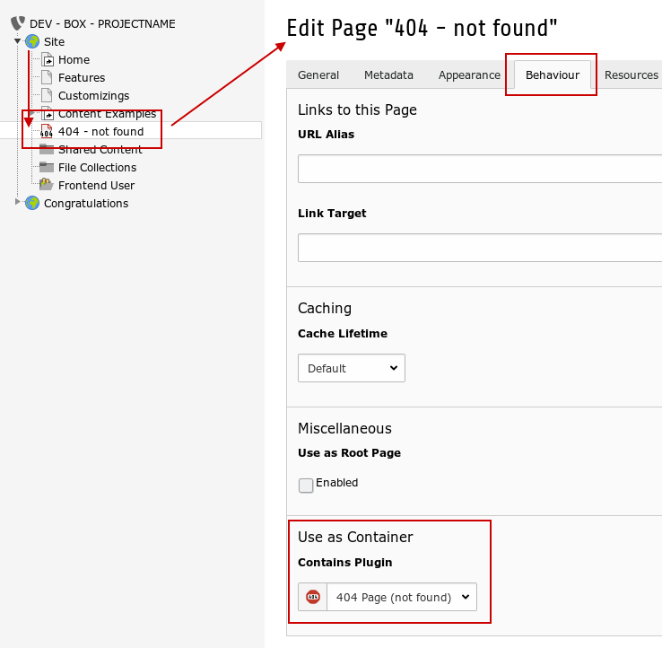

.. include:: ../Includes.txt

Usage
=====

When a requested page couldn't be found in TYPO3 it call this extension.

This is what happens then

- check if were in a loop and if so, show the internal 404 page
- check if page exists on another domain and if so do a 301 redirect
- show custom error page if exists
- redirect to root page on domain if possible
- show internal 404 page and exit

If this behaviour doesn't fit to your needed functionality you have to use another 404 extension or change the code of
this extension.

Setup
-----

No configuration is needed but the extension depends on some prerequisite.

- Domain records exists
- that's it

Custom 404 Page
---------------

A custom 404 page is a normal TYPO3 page. I suggest you mark it with 'not in menu'.

Two things are a must for that page to work:

- it has to be a child page of the page which has the domain record on it
- select '404 Page' in the field *Contains Plugin* in the *Behaviour* tab:

    Setup custom 404 page.

The 404 page will be shown with a different icon in the page tree.

To test if your page work:

- preview the page
- call a page which doesn't exists (e.g. http://example.com/?id=99999999)

.. note::
    In previous versions the *alias* field was used to identify the custom 404 page. Although those pages still work, this
    is deprecated. The reason for the change is that only one page with an alias name is possible, which doesn't work with a
    multi site installation.

Remarks
-------

It seems weird but the topic 404 handling is in fact complex. Unavailable configuration, a bit clunky core api, absence of magic.

The extension is not heavily tested in different environments. For me it works as expected, but you should test it with
your setup - which is a good idea anyways.

Debugging
---------

In ``auto404/Classes/Hooks/FrontendHook.php::log`` theres a commented line with ``error_log()``. Uncomment the line and
you get some logging in the php error log.
